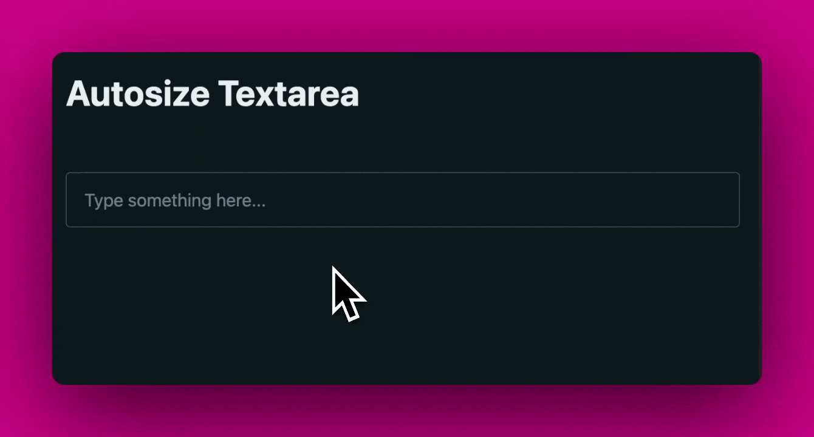

# Autosize Textarea



## Description

A simple textarea component that automatically resizes to fit its content.

## Installation

```bash
npm install autosize-textarea
```

## Usage

```html
<head>
  <script type="module" src="./autosize-textarea.js"></script>
  <style>
    textarea {
      resize: none;
    }
  </style>
</head>
<body>
  <autosize-textarea>
    <textarea rows="1" placeholder="Type something here..."></textarea>
  </autosize-textarea>
</body>
</html>
```

## Gotchas

- The component will not resize if the `rows` attribute is set. This is because the component will not know how many rows to resize to. If you want to set the initial number of rows, use the `lines` attribute instead.

- usage

- gotchas


- remove resize in the css
- set lines = "1" in the html, we do it when setting up, but because the component registers later, you'll see the textarea change height